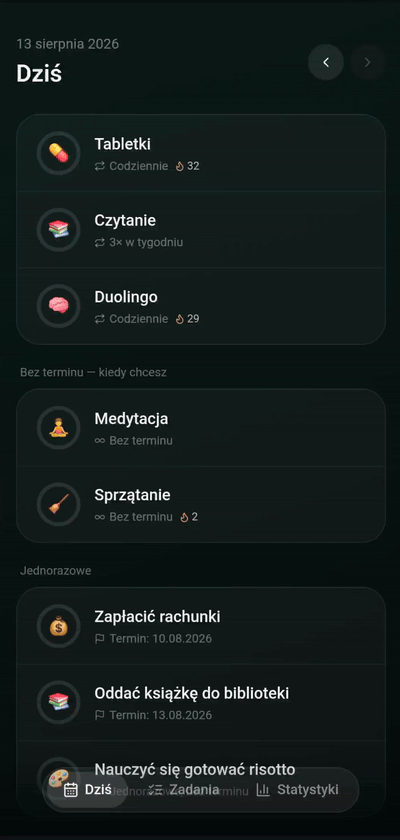

# Task Tracker

A personal habit & task tracker built as an installable PWA. Unlike typical reminder apps, it distinguishes between tasks with a fixed schedule, tasks with no schedule at all, and one-off tasks with a deadline — and logs how many times each was actually completed, per month.

<p align="center">
  
</p>

## Features

- Three task types: recurring (daily / specific weekdays / X times a week), flexible (no schedule), one-off (with or without a due date)
- Custom color, emoji, and category per task
- Daily checklist with swipe navigation between tabs, retroactive editing of past days, and an "upcoming" section for future-dated one-offs
- Streaks and monthly stats with month-over-month trend comparison, full history navigation
- Installable PWA — offline support, home-screen icon, no app store
- JSON export/import for backups

## Tech stack

React 18 · Vite · Tailwind CSS · lucide-react · `localStorage` (no backend) · deployed on Vercel

## Project structure

```
src/
  theme.js, storage.js, utils.js   — constants, persistence, business logic
  ui.jsx                            — shared UI components
  views/                            — TodayView, TasksView, StatsView, modals
  App.jsx                           — state + wiring
```

## Running locally

```bash
npm install
npm run dev
```

## Deploying

```bash
vercel --prod
```
